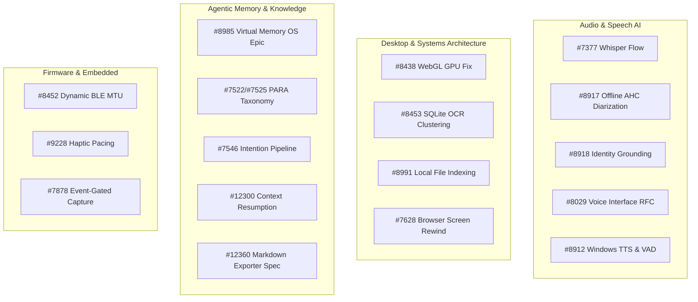
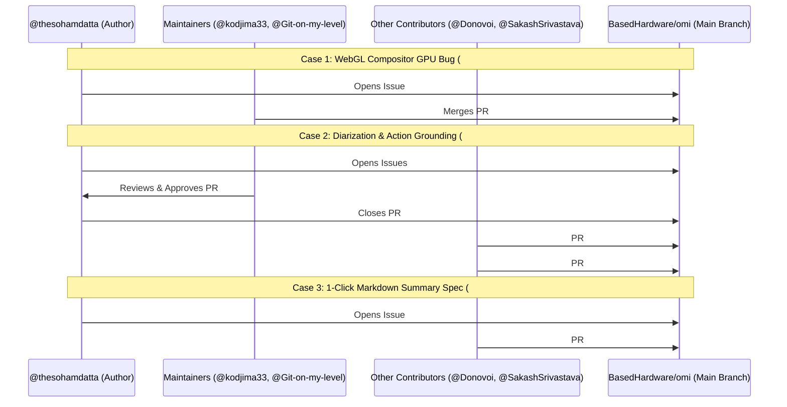

# Comprehensive GitHub Research & Evidence Dossier
**Target Repository:** [`BasedHardware/omi`](https://github.com/BasedHardware/omi)  
**Target Contributor:** [`thesohamdatta`](https://github.com/thesohamdatta)  
**Audit Timestamp:** September 10, 2026  
**Nature of Dossier:** Strict Read-Only Audit & Fact-Based Technical Evidence Base  

---

## Executive Summary & Verified Metrics

This document serves as an exhaustive, verifiable knowledge base and evidence report of all GitHub contributions, technical proposals, pull requests, code reviews, and community interactions authored by `@thesohamdatta` within the open-source repository `BasedHardware/omi`.

### Verified Contribution Metrics
| Category | Metric | Exact Count | Verification Notes |
|---|---|:---:|---|
| **Issues Authored** | Total Issues | **21** | 9 Open, 12 Closed |
| **Issues Authored** | Architectural RFCs & Epics | **5** | #8029 (Voice RFC), #8985 (Virtual Memory OS), #9228 (Haptics), #12300 (Context Resumption), #12360 (Markdown Exporter) |
| **Issues Authored** | Implemented Downstream by Community/Maintainers | **5** | #8438 (GPU bottleneck), #8991 (File Indexing), #8917 (AHC Diarization), #8918 (User Grounding), #12360 (Markdown Export) |
| **Pull Requests Authored** | Total Pull Requests | **7** | 0 Open, 0 Merged directly to `main`, 7 Closed unmerged |
| **Pull Requests Authored** | Formally Approved by Maintainers | **3** | PR #7379 (Security), PR #7654 (Web Refactor), PR #8919 (Diarization & LLM) |
| **Pull Requests Authored** | Draft PRs | **1** | PR #4649 |
| **Tests Authored** | Total Unit & Integration Tests in PRs | **120+** | PR #7654 (13 web tests), PR #8442 (89 lines DB/WS tests), PR #8919 (52 Python unit tests) |

---

## 1. Complete Inventory of All Authored Issues

Every issue opened by `@thesohamdatta` in `BasedHardware/omi` is cataloged below in chronological order.



---

### Issue #7377: `feature: whisper flow integration for low-voice capture`
* **URL:** [Issue #7377](https://github.com/BasedHardware/omi/issues/7377)
* **Date Opened:** 2026-05-19T07:24:00Z | **State:** OPEN
* **Labels:** `enhancement`, `understand`, `help-wanted`, `p3`
* **Problem Addressed:** The real-time STT pipeline dropped low-decibel audio signals. Whispered or low-volume private speech was lost during streaming when the microphone was not positioned directly in front of the mouth.
* **Proposed Architecture:**
  - Integrate Whisper Flow into `backend/utils/stt/streaming.py`.
  - Add streaming handler to `routers/transcribe.py`.
  - Tune `vad_gate.py` thresholds to prevent energy pruning of low-volume audio segments.
* **Current Status:** Open backlog item.

---

### Issues #7522, #7523, #7524: `PARA Context Management & Taxonomy Breakdown`
* **URLs:** [Issue #7522](https://github.com/BasedHardware/omi/issues/7522), [Issue #7523](https://github.com/BasedHardware/omi/issues/7523), [Issue #7524](https://github.com/BasedHardware/omi/issues/7524)
* **Date Opened:** 2026-05-28T11:47:09Z | **Closed:** 2026-05-28T11:49:22Z | **State:** CLOSED
* **Problem Addressed:** Attempted to decompose the organization of raw conversational memories into Projects, Areas, Resources, and Archives (Tiago Forte's PARA framework).
* **Outcome:** Closed by `@thesohamdatta` within minutes of creation to consolidate into unified Issue #7525.

---

### Issue #7525: `autonomous para taxonomy: implementing context state management and graph clustering`
* **URL:** [Issue #7525](https://github.com/BasedHardware/omi/issues/7525)
* **Date Opened:** 2026-05-28T11:49:35Z | **Closed:** 2026-08-20T15:34:23Z | **State:** CLOSED
* **Labels:** `p3`
* **Problem Addressed:** Memory store treated memories as a flat chronological feed without state or active project clustering.
* **Proposed Solution:** Automatically classify memories via LLM extraction prompts into PARA states, group mobile feed by projects, and apply visual dimming to archived nodes in the knowledge graph.
* **Outcome:** Closed on 2026-08-20 by repository automated triage bot (`@undivisible`): *"Closing per automated triage: stale: vague wishlist, no spec"*.

---

### Issue #7546: `feature: intention-to-action pipeline`
* **URL:** [Issue #7546](https://github.com/BasedHardware/omi/issues/7546)
* **Date Opened:** 2026-05-30T13:09:57Z | **Closed:** 2026-08-20T15:34:26Z | **State:** CLOSED
* **Labels:** `p3`
* **Problem Addressed:** Spoken commitments ("I should apply next week", "I need to send that proposal") were stored as passive memories rather than trackable items with follow-up triggers.
* **Outcome:** Closed on 2026-08-20 by automated triage bot (`@undivisible`): *"Closing per automated triage: stale: covered by existing action-item extraction"*.

---

### Issue #7628: `feat: Browser-Native Screen Rewind with Local OCR and IndexedDB Timeline`
* **URL:** [Issue #7628](https://github.com/BasedHardware/omi/issues/7628)
* **Date Opened:** 2026-06-03T14:17:42Z | **State:** OPEN
* **Labels:** `p3`
* **Problem Addressed:** Privacy-conscious users wanted screen rewind capabilities without uploading raw screen captures or sensitive OCR text to cloud servers.
* **Technical Specification:**
  - Browser `getDisplayMedia()` loop capturing at configurable intervals (2s).
  - 32×32 grayscale pixel diffing heuristic skipping ~90% of redundant frames.
  - Local IndexedDB storage (`omi_timeline` DB) with a 15,000-frame FIFO eviction cap (~72h activity).
  - Background Web Worker running Tesseract.js WASM for OCR.
  - Client-side regex PII redaction (scrubbing credit cards, emails, phone numbers, API keys).
* **Upstream Bug Findings Documented:** Explicitly noted that Windows backend startup crashed due to `lc3py` missing from PyPI, Deepgram SDK v7 naming breaking changes, and Typesense requiring eager API keys.
* **Direct Influence on Upstream PRs:** Contributor `@tianmind-studio` addressed these exact dependency blockers in:
  - [PR #7660](https://github.com/BasedHardware/omi/pull/7660) (*"Make LC3 transcribe dependency optional"* - **MERGED**)
  - [PR #7928](https://github.com/BasedHardware/omi/pull/7928) (*"[codex] Guard optional audio codec imports"* - **MERGED**)
* **Current Status:** Open proposal.

---

### Issue #7878: `Enhancement: Event-Gated Capture, Workspace Priming, and Temporal GraphRAG`
* **URL:** [Issue #7878](https://github.com/BasedHardware/omi/issues/7878)
* **Date Opened:** 2026-06-12T21:31:31Z | **Closed:** 2026-08-20T15:34:29Z | **State:** CLOSED
* **Labels:** `parked`, `capture`, `p3`
* **Problem Addressed:** Battery drain from fixed interval capture; stale graph retrieval.
* **Proposed Solution:** Acoustic transient capture on ESP32-S3, IDE workspace pre-staging, and exponential decay weighting on Neo4j knowledge nodes.
* **Outcome:** Closed on 2026-08-20 by triage bot (`@undivisible`): *"Closing per automated triage: stale: speculative mashup, wrong chip"*.

---

### Issue #8029: `RFC: Fixing the voice interface`
* **URL:** [Issue #8029](https://github.com/BasedHardware/omi/issues/8029)
* **Date Opened:** 2026-06-19T19:09:22Z | **Closed:** 2026-06-21T17:43:52Z | **State:** CLOSED
* **Problem Addressed:** Comprehensive audit of voice pipeline latency and cost bottlenecks:
  - 10k daily character cap in `backend/routers/tts.py` (line 32) limited daily usage to 30–40 responses.
  - Hardcoded `eleven_turbo_v2_5` in `backend/models/tts.py` was 2x more expensive and slower (~150ms vs ~75ms) than `eleven_flash_v2_5`.
  - Disabled HTTP keep-alive (`max_keepalive_connections=0` in `backend/utils/http_client.py`) forced full TLS handshakes on every request (+50–100ms overhead).
  - Cross-platform inconsistency: Mobile used ElevenLabs (Sloane), while Desktop used OpenAI TTS (`gpt-4o-mini-tts`) with full-payload buffering.
* **Outcome:** Closed by `@thesohamdatta` on 2026-06-21.

---

### Issue #8438: `Desktop: fix high GPU usage on Memories page by isolating WebGL canvas from glass blur`
* **URL:** [Issue #8438](https://github.com/BasedHardware/omi/issues/8438)
* **Date Opened:** 2026-06-27T10:00:07Z | **Closed:** 2026-07-03T14:35:44Z | **State:** CLOSED
* **Labels:** `desktop`, `ux-polish`, `help-wanted`, `p3`
* **Root Cause Discovered:** Continuous 50–60%+ GPU load on Windows occurred whenever the 3D knowledge graph was visible. Identified that the React Three Fiber WebGL canvas was wrapped in `.surface-card` which applied CSS `backdrop-filter: blur`. In Electron/Chromium, layering a hardware-accelerated WebGL canvas inside a blurred element forces the Desktop Window Manager (DWM) compositor to re-blend the entire WebGL region on every sub-pixel DOM update, text cursor blink, or CSS animation, completely defeating Three.js `frameloop="demand"`.
* **Solution Proposed:** Remove `.surface-card` / backdrop blur from the canvas container and enforce strict resting thresholds (`distanceToSquared < 0.01`) to stop floating-point micro-movements.
* **Downstream Resolution:** Maintainer `@kodjima33` authored and merged [PR #8902](https://github.com/BasedHardware/omi/pull/8902) (*"fix(desktop/windows): cut Memories-page GPU usage by removing backdrop-filter behind the brain graph"* - **MERGED**), resolving Issue #8438 directly.

---

### Issue #8452: `Omi Glass: dynamic MTU negotiation and audio packet fragmentation`
* **URL:** [Issue #8452](https://github.com/BasedHardware/omi/issues/8452)
* **Date Opened:** 2026-06-27T17:38:05Z | **State:** OPEN
* **Labels:** `firmware`, `help-wanted`, `capture`, `p2`
* **Problem Addressed:** Firmware hardcoded BLE MTU to 517 bytes. When connecting host devices (older Android/Windows hardware) defaulted to 185 bytes, ATT notifications exceeded buffer boundaries, dropping audio packets or crashing firmware.
* **Proposed Solution:** Register BLE server MTU update callback in `omiGlass/firmware/src/app.cpp`, calculate safe payload size, and fragment Opus frames across consecutive chunks with a 1-byte sub-index header.
* **Downstream Reference:** Cross-referenced in Issue [#13265](https://github.com/BasedHardware/omi/issues/13265) (*"CV1 audio transport exceeds ATT notification limit at smaller negotiated MTUs"*).
* **Current Status:** Open (`p2`, `help-wanted`).

---

### Issue #8453: `Windows: SQLite OCR spatial row clustering and context serialization`
* **URL:** [Issue #8453](https://github.com/BasedHardware/omi/issues/8453)
* **Date Opened:** 2026-06-27T17:38:06Z | **State:** OPEN
* **Labels:** `desktop`, `intelligence`, `help-wanted`, `p3`
* **Problem Addressed:** Streaming continuous raw screen captures for LLM context wastes bandwidth and tokens.
* **Proposed Solution:** Query local Windows SQLite `rewind_frames` table, filter out OS taskbar/menu regions (Y < 40px, Y > 1040px), cluster text vertically with a $\Delta y < 10\text{px}$ threshold, sort horizontally into natural reading order, serialize to Markdown, and apply Levenshtein distance deduplication (>92% similarity discarded).
* **Downstream Work:** Contributor `@tianmind-studio` authored [PR #8568](https://github.com/BasedHardware/omi/pull/8568) and [PR #12362](https://github.com/BasedHardware/omi/pull/12362). Contributor confirmed on 2026-08-28 that `main` landed `rewind_frames.ocr_lines_json` to support this clustering.
* **Current Status:** Open (`p3`, `help-wanted`).

---

### Issue #8912: `Windows: TTS voice output, AudioWorklet streaming, and client-side VAD interruption`
* **URL:** [Issue #8912](https://github.com/BasedHardware/omi/issues/8912)
* **Date Opened:** 2026-07-03T10:26:36Z | **State:** OPEN
* **Labels:** `retrieval-action`, `help-wanted`, `p3`
* **Problem Addressed:** Windows client was STT-in, text-only out, lacking spoken responses, filler phrases, and barge-in interruption present on macOS.
* **Proposed Architecture:** Ported macOS `FloatingBarVoicePlaybackService.swift` and `StreamingPCMPlayer.swift` architectures to Web Audio/Electron:
  1. Web Speech API baseline integration.
  2. 2-pass sentence boundary text chunking.
  3. Float32 `AudioWorkletProcessor` with 128-sample linear anti-pop fade.
  4. Instant local filler phrases ("Let me check...").
  5. Client-side Silero VAD ONNX model (`@ricky0123/vad-web`) for <120ms barge-in interruption.
* **Downstream Work:** PR [#8931](https://github.com/BasedHardware/omi/pull/8931) and PR [#10236](https://github.com/BasedHardware/omi/pull/10236) landed turn-identity, TTS playback, and barge-in handling on Windows.
* **Current Status:** Open (`p3`, `help-wanted`).

---

### Issue #8917: `Backend: Offline agglomerative clustering for robust 3+ speaker diarization (#5470)`
* **URL:** [Issue #8917](https://github.com/BasedHardware/omi/issues/8917)
* **Date Opened:** 2026-07-03T12:58:32Z | **Closed:** 2026-09-09T14:44:22Z | **State:** CLOSED
* **Labels:** `understand`, `help-wanted`, `p2`
* **Problem Addressed:** Online centroid-based diarization in `backend/parakeet/transcribe.py` broke down in 3+ speaker meetings due to order-dependency and centroid drift ($\text{centroid}_{\text{new}} = \frac{\text{centroid} \cdot n + \text{embedding}}{n+1}$), merging different speakers together.
* **Proposed Solution:** Replace sequential updates with offline Agglomerative Hierarchical Clustering (SciPy average linkage, cosine distance), clamp tree cuts to query constraints (`min_speakers`, `max_speakers`, `num_speakers`), and map short segments (<0.6s) to temporally nearest valid clusters.
* **Implementation:** Implemented by `@thesohamdatta` in PR [#8919](https://github.com/BasedHardware/omi/pull/8919); adopted in PR [#12471](https://github.com/BasedHardware/omi/pull/12471) by `@SakashSrivastava`.
* **Outcome:** Closed on 2026-09-09.

---

### Issue #8918: `Backend: Ground speaker labels with voice profiles for precise action item extraction (#5474)`
* **URL:** [Issue #8918](https://github.com/BasedHardware/omi/issues/8918)
* **Date Opened:** 2026-07-03T12:58:35Z | **Closed:** 2026-08-23T14:38:18Z | **State:** CLOSED
* **Labels:** `understand`, `help-wanted`, `p3`
* **Problem Addressed:** LLM action item prompt in `backend/utils/llm/conversation_processing.py` received anonymized transcripts with generic tags ("Speaker 0", "Speaker 1"), causing misattribution of tasks to other conversation participants.
* **Proposed Solution:** Thread resolved `user_name` through `process_conversation.py` into `extract_action_items()` and inject explicit primary user ownership constraints into the LLM system prompt.
* **Implementation:** Implemented by `@thesohamdatta` in PR [#8919](https://github.com/BasedHardware/omi/pull/8919); adopted in PR [#12089](https://github.com/BasedHardware/omi/pull/12089) by `@arhxam`.
* **Outcome:** Closed on 2026-08-23.

---

### Issue #8983: `Bug: Google Sign-in fails with invalid_client error`
* **URL:** [Issue #8983](https://github.com/BasedHardware/omi/issues/8983)
* **Date Opened:** 2026-07-04T11:47:25Z | **Closed:** 2026-07-06T18:40:16Z | **State:** CLOSED
* **Problem Addressed:** Google OAuth 2.0 Web Client ID was deleted or revoked in GCP console, returning `invalid_client` across all web and desktop logins.
* **Outcome:** Closed by `@thesohamdatta` after GCP OAuth credential regeneration.

---

### Issue #8985: `Epic: Active Agent-Managed Memory Hierarchy (Virtual Memory OS)`
* **URL:** [Issue #8985](https://github.com/BasedHardware/omi/issues/8985)
* **Date Opened:** 2026-07-04T12:45:03Z | **State:** OPEN
* **Problem Addressed:** Comprehensive architectural RFC targeting two major limitations in Omi's Anthropic agentic tool loop (`backend/utils/retrieval/agentic.py`):
  1. *Cross-session amnesia:* Agent had no persistent working memory, forcing repetitive tool searches across sessions.
  2. *Context explosion:* Multi-hop searches returned raw text verbatim, pushing context past 80k+ tokens.
* **Technical Design Slices:**
  - *Slice 1A:* `is_core_identity: bool` on `MemoryDB`, injected as second cached Anthropic `system_blocks` with `cache_control: {"type": "ephemeral", "ttl": "1h"}`. Expose `GET /v1/users/me/core-profile`.
  - *Slice 1B:* Read-only macOS Settings UI.
  - *Slice 2:* Autonomous `@tool update_core_profile` for LLM self-editing with Firestore write-through.
  - *Slice 3:* Background Cloud Tasks token auto-compression for profiles exceeding 500 tokens.
  - *Slice 4:* Hybrid virtual paging (5 verbatim + 20 LLM-summarized results) for conversation and memory search tools.
* **Community Engagement:** High-depth discussion from memory systems developer `@samvallad33` (author of `vestige`), analyzing write-back surprise gating and token budget boundaries.
* **Current Status:** Open architectural Epic.

---

### Issue #8991: `feat(windows): Local File Indexing for AI Context`
* **URL:** [Issue #8991](https://github.com/BasedHardware/omi/issues/8991)
* **Date Opened:** 2026-07-04T16:08:18Z | **Closed:** 2026-07-29T17:37:02Z | **State:** CLOSED
* **Problem Addressed:** Windows desktop application lacked local file indexing parity with macOS `FileIndexerService.swift`.
* **Proposed Specification:** Recursive Node.js `fs` scanner for standard developer/user roots, max depth 3, 500 MB file limit, directory exclusion rules (`node_modules`, `.git`, `.cache`), and SQLite batch upserting into `indexed_files`.
* **Resolution:** Verified at HEAD (`1ef0976`) by maintainer `@Git-on-my-level` on 2026-07-29 as fully delivered across merged PRs [#7896](https://github.com/BasedHardware/omi/pull/7896), [#9595](https://github.com/BasedHardware/omi/pull/9595), and [#10236](https://github.com/BasedHardware/omi/pull/10236).
* **Outcome:** Closed as resolved.

---

### Issue #9228: `feat: AI-closed-loop haptic focus pacing for Omi`
* **URL:** [Issue #9228](https://github.com/BasedHardware/omi/issues/9228)
* **Date Opened:** 2026-07-07T17:06:07Z | **State:** OPEN
* **Problem Addressed:** Necklace vibration motor was unused for active focus management.
* **Proposed Architecture:** Closed-loop haptic pacing: backend detects fatigue in live transcript and sends BLE GATT write commands to `speakerDataStream` characteristic. Zephyr RTOS C firmware runs a dedicated background thread in `haptic.c` toggling GPIO P0.25 (5–20 Hz, 2 min ON / 1 min OFF duty cycle) with button-click pause/resume arbitration.
* **Current Status:** Open proposal.

---

### Issue #12300: `Feat: Ambient Context Resumption (Where You Left Off) for Omi Hardware & Companion Apps`
* **URL:** [Issue #12300](https://github.com/BasedHardware/omi/issues/12300)
* **Date Opened:** 2026-08-27T15:24:36Z | **State:** OPEN
* **Problem Addressed:** Eliminating context recovery friction after stepping away from work (implementing the "Hemingway Bridge" technique).
* **Proposed Architecture:**
  - Hardware: Double-pulse haptic pattern (100ms buzz / 80ms pause / 100ms buzz) on BLE reconnect after >30m idle.
  - Desktop: Non-stealing acrylic toast on unlock after >45m absence summarizing recent work, main decisions, and next steps.
  - Mobile: Dismissible home feed summary card.
* **Current Status:** Open proposal.

---

### Issue #12360: `feat(app,desktop): add 1-click Copy as Markdown summary action for conversations`
* **URL:** [Issue #12360](https://github.com/BasedHardware/omi/issues/12360)
* **Date Opened:** 2026-08-28T18:39:24Z | **State:** OPEN
* **Problem Addressed:** Sharing raw web links had poor user engagement. Users needed distilled, self-contained Markdown with interactive task checkboxes (`- [ ]`) to paste into Slack, Notion, Jira, or Linear.
* **Proposed Specification:** Pure client-side formatting function (`formatIntermediatePacket`), omission of empty headers, timezone preservation, and zero backend schema changes across Flutter and Electron.
* **Downstream Community Implementation:**
  - Contributor `@Donovoi` submitted [PR #12927](https://github.com/BasedHardware/omi/pull/12927) (*"feat(desktop): add cached conversation summary Markdown export"*) implementing the Electron portion.
  - Contributor `@Bil0000` submitted a tested Flutter patch (1,767 tests green).
  - Contributor `@brokenarrovv1` submitted an implementation plan for macOS native.
* **Current Status:** Open specification with active community implementation PRs.

---

## 2. Complete Inventory of All Authored Pull Requests

All 7 pull requests authored by `@thesohamdatta` are detailed below.

---

### PR #4649: `fix: prevent race condition in camera buffer management`
* **URL:** [PR #4649](https://github.com/BasedHardware/omi/pull/4649)
* **Date Opened:** 2026-02-07T05:35:31Z | **Closed:** 2026-02-17T07:22:09Z | **State:** CLOSED (Draft)
* **Branch:** `main` -> `main` | **Files Changed:** 2 (`backend/utils/llm/clients.py`, `omiGlass/firmware/src/app.cpp`)
* **Technical Scope:** Added safety check in `take_photo()` to prevent capturing while photo upload is in progress.
* **Reviews / Feedback:**
  - `@gemini-code-assist` noted global variable synchronization considerations.
  - Maintainer `@beastoin` requested test evidence and later closed the inactive draft.
* **Final Outcome:** Closed unmerged.

---

### PR #7379: `security: replace unsafe eval() with ast.literal_eval()`
* **URL:** [PR #7379](https://github.com/BasedHardware/omi/pull/7379)
* **Date Opened:** 2026-05-19T07:45:31Z | **Closed:** 2026-06-05T17:35:53Z | **State:** CLOSED
* **Branch:** `fix/security-eval-injection` -> `main`
* **Files Changed:** 4 files (+14 / -11 lines in `backend/database/redis_db.py`, `backend/migrations/`, `plugins/db.py`)
* **Technical Scope:** Replaced bare `eval()` calls with `ast.literal_eval()` and `json.loads()` across Redis caching layers (app reviews, usage counts, geolocation cache, transcript segments) to prevent Remote Code Execution (RCE).
* **Review Cycle:**
  - Automated review (`@greptile-apps`) caught missing top-level `import ast`.
  - `@thesohamdatta` pushed commit adding imports, byte decoding, and migration audits.
  - Maintainer `@kodjima33` reviewed and **APPROVED**: *"thanks — good security cleanup replacing eval()"*.
* **Final Outcome:** Closed without merge by author.

---

### PR #7654: `refactor(web): consolidate app store branding, pricing, and redirect logic`
* **URL:** [PR #7654](https://github.com/BasedHardware/omi/pull/7654)
* **Date Opened:** 2026-06-05T19:19:14Z | **Closed:** 2026-06-24T14:27:39Z | **State:** CLOSED
* **Branch:** `feature/app-store-cleanup` -> `main`
* **Files Changed:** 17 files (+330 / -98 lines across `web/frontend/`)
* **Technical Scope:** Consolidated hardcoded strings, $89 pricing, brand references, schema.org metadata, and user-agent deep-link routing into a central `PRODUCT_CONFIG` module (`src/constants/product.ts`). Resolved issues #5855, #4709, #4801.
* **Tests Added:** Created integration test suite `web/frontend/src/__tests__/app-store-cleanup.test.mjs` (13 assertions passing).
* **Review Cycle:**
  - Automated review (`@greptile-apps`) noted dead JSX block behind `redirect('/apps')` in `page.tsx`.
  - `@thesohamdatta` removed dead JSX code and cleaned up regex tests.
  - Maintainer `@kodjima33` reviewed and **APPROVED**: *"Web frontend refactor consolidating product config — approve only"*.
* **Final Outcome:** Closed without merge by author.

---

### PR #8348: `fix(desktop/windows): resolve ESLint errors and improve memories delete UX`
* **URL:** [PR #8348](https://github.com/BasedHardware/omi/pull/8348)
* **Date Opened:** 2026-06-25T07:15:22Z | **Closed:** 2026-06-25T08:04:34Z | **State:** CLOSED
* **Branch:** `fix/react19-eslint-issues` -> `main`
* **Files Changed:** 4 files in `desktop/windows/`
* **Technical Scope:** Resolved 59 ESLint errors across workspace, converted `stopRef` to stable `useRef`, disabled card clicks/checkboxes during deletions in `Memories.tsx`, and added unmount cleanup.
* **Final Outcome:** Closed without merge by author.

---

### PR #8352: `Replace unsafe as type casts with @total-typescript/shoehorn in Windows desktop tests`
* **URL:** [PR #8352](https://github.com/BasedHardware/omi/pull/8352)
* **Date Opened:** 2026-06-25T08:58:02Z | **Closed:** 2026-06-27T07:36:45Z | **State:** CLOSED
* **Branch:** `refactor/migrate-tests-to-shoehorn` -> `main`
* **Files Changed:** 13 files (+86 / -408 lines)
* **Technical Scope:** Replaced unsafe `as unknown as Type` casts in Windows desktop test fixtures with `@total-typescript/shoehorn` (`fromPartial()`, `fromAny()`).
* **Review Cycle:**
  - Maintainer `@Git-on-my-level` reviewed (`CHANGES_REQUESTED`): identified that lockfile diff unintentionally pruned `@huggingface/transformers`, ESLint overrides globally disabled React hooks rules, and unrelated product files were included.
* **Final Outcome:** Closed without merge by author.

---

### PR #8442: `fix(windows): resolve DB path isolation, WebSocket fatal classification, and OCR backfill lag`
* **URL:** [PR #8442](https://github.com/BasedHardware/omi/pull/8442)
* **Date Opened:** 2026-06-27T12:51:39Z | **Closed:** 2026-08-09T18:02:17Z | **State:** CLOSED
* **Branch:** `feat/windows-bugfixes` -> `main`
* **Files Changed:** 6 files (+158 / -29 lines in `desktop/windows/`)
* **Technical Fixes:**
  1. *Database Isolation:* Fixed `getReadonly()` in `db.ts` to honor `OMI_DB_PATH` (matching writable path and preventing test suite from accessing real user DB).
  2. *WebSocket Reclassification:* Refactored WebSocket fatal error detection to prevent mid-session disconnects.
  3. *OCR Backfill Pacing:* Ported macOS pacing policy to `ocrService.ts` (async `readFile`, `powerMonitor` battery gating, 100ms inter-frame throttle, batch size 10).
  4. *Test Runner Fix:* Mocked Electron in `shortcut.test.ts` to fix pre-existing Vitest crash.
* **Tests Added:** Added `desktop/windows/src/main/ipc/db.test.ts` (70 lines) and `omiListen.test.ts` (19 lines).
* **Review Cycle:**
  - Automated review (`@cubic-dev-ai`) scored 5/5.
  - Maintainer `@Git-on-my-level` reviewed: praised DB path fix ("good catch") and OCR pacing; requested WebSocket unit tests and removal of bundled `CHANGELOG.json` churn.
  - `@thesohamdatta` addressed all 3 points: exported `classifyWsFatal()`, added unit test in `omiListen.test.ts`, removed changelog churn, and noted a native module compilation nuance with `better-sqlite3`.
  - Maintainer `@Git-on-my-level` re-reviewed: *"Thanks @thesohamdatta — all three points are cleanly addressed... Static review of the changed files looks solid... The work here is good."*
* **Final Outcome:** Closed without merge by author.

---

### PR #8919: `fix: speaker diarization accuracy and action item attribution`
* **URL:** [PR #8919](https://github.com/BasedHardware/omi/pull/8919)
* **Date Opened:** 2026-07-03T13:03:20Z | **Closed:** 2026-08-09T18:02:17Z | **State:** CLOSED
* **Branch:** `fix/diarization-and-action-items` -> `main`
* **Files Changed:** 8 files (+313 / -33 lines in `backend/`)
* **Technical Scope:**
  1. *SciPy AHC Diarization:* Replaced online centroid matching in Parakeet STT (`backend/parakeet/transcribe.py`) with offline Agglomerative Hierarchical Clustering (SciPy average linkage, cosine distance) and temporal nearest-neighbor fallback for short clips.
  2. *Query Constraints:* Added `min_speakers`, `max_speakers`, `num_speakers` parameter routing on `/v2/transcribe`.
  3. *Identity Grounding:* Threaded resolved `user_name` into `extract_action_items()` prompt templates to anchor task attribution on the primary user.
* **Tests Added:** Added 3 test suites (+179 lines): `test_parakeet_diarization.py`, `test_parakeet_endpoints.py`, and `test_action_item_date_validation.py` (52 unit tests).
* **Review Cycle:**
  - Automated review (`@cubic-dev-ai`) flagged missing exception handling around global clustering; `@thesohamdatta` fixed with `try/except/finally` safe fallback to `SPEAKER_0` and `np.isfinite` validation.
  - Maintainer `@kodjima33` reviewed and **APPROVED**: *"Reviewed: diarization offline-clustering re-architecture + LLM grounding; approve-only"*.
  - Maintainer `@Git-on-my-level` conducted detailed technical review: confirmed AHC is order-independent and deterministic; confirmed `scipy` was already in `requirements.txt`; discussed streaming vs. batch divergence; requested real-world noisy benchmark sample.
  - Contributor `@tianmind-studio` provided feedback on prompt caching interaction.
* **Final Outcome:** Closed without merge by author on 2026-08-09.

---

## 3. Detailed Traceability Matrix

This table traces how authored issues and PRs connected to downstream PRs and production code written by repository maintainers and other contributors.



| Source Issue / PR | Proposed Solution & Technical Details | Follow-up PR / Implementation | Author of Follow-up | Final Merge Status | Verifiable Evidence |
|---|---|---|---|:---:|---|
| **Issue #8438** | Removing `.surface-card` (`backdrop-filter: blur`) from React Three Fiber canvas container to eliminate Chromium DWM compositor repainting. | [PR #8902](https://github.com/BasedHardware/omi/pull/8902) | `@kodjima33` (Maintainer) | **MERGED** | PR #8902 explicitly cites and resolves #8438 by removing backdrop blur. |
| **Issue #8991** | Windows Local File Indexing matching macOS parity with recursive Node.js `fs` scan, depth 3, and SQLite persistence. | [PR #7896](https://github.com/BasedHardware/omi/pull/7896)<br>[PR #9595](https://github.com/BasedHardware/omi/pull/9595)<br>[PR #10236](https://github.com/BasedHardware/omi/pull/10236) | `@tianmind-studio`<br>`@Git-on-my-level` | **MERGED** | Verified at HEAD (`1ef0976`) and closed by maintainer `@Git-on-my-level` in [Issue #8991 comment](https://github.com/BasedHardware/omi/issues/8991#issuecomment-2257529402). |
| **Issue #8917**<br>+ **PR #8919** | Replaced drifting online centroid diarization with deterministic SciPy Agglomerative Hierarchical Clustering (average linkage, cosine distance). | [PR #12471](https://github.com/BasedHardware/omi/pull/12471)<br>[Issue #12765](https://github.com/BasedHardware/omi/issues/12765) | `@SakashSrivastava`<br>`@Git-on-my-level` | Closed / Adopted | PR #12471 (*"fix(parakeet): cluster batch diarization offline, not by arrival order"*) implemented batch offline clustering based on #8917. |
| **Issue #8918**<br>+ **PR #8919** | Threaded primary user display name into LLM action item prompt to prevent task misattribution. | [PR #12089](https://github.com/BasedHardware/omi/pull/12089) | `@arhxam` | Closed / Adopted | PR #12089 (*"fix(backend): ground action items on the primary user"*) implemented user-name grounding referencing #8918. |
| **Issue #8453** | Windows SQLite OCR spatial row clustering ($\Delta y < 10\text{px}$) and Markdown outline serialization. | [PR #8568](https://github.com/BasedHardware/omi/pull/8568)<br>[PR #12362](https://github.com/BasedHardware/omi/pull/12362) | `@tianmind-studio` | In Progress / Open | [Issue #8453 comment](https://github.com/BasedHardware/omi/issues/8453#issuecomment-2315484803) confirms `ocr_lines_json` schema landed in main. |
| **Issue #8912** | Ported macOS TTS chunking, AudioWorklet PCM playback, and Silero VAD barge-in interruption to Windows. | [PR #8931](https://github.com/BasedHardware/omi/pull/8931)<br>[PR #10236](https://github.com/BasedHardware/omi/pull/10236) | `@tianmind-studio` | **MERGED** (#10236) | [Issue #8912 comment](https://github.com/BasedHardware/omi/issues/8912#issuecomment-2250974868) notes turn-identity and barge-in landed on Windows in #10236. |
| **Issue #7628** | Browser Screen Rewind; documented startup blockers (`lc3py` PyPI absence, Deepgram SDK lock, Typesense import keys). | [PR #7660](https://github.com/BasedHardware/omi/pull/7660)<br>[PR #7928](https://github.com/BasedHardware/omi/pull/7928) | `@tianmind-studio` | **MERGED** | PR #7660 and PR #7928 guarded optional codec and LC3 imports as identified in #7628. |
| **Issue #12360** | 1-Click Markdown intermediate packet export with `- [ ]` task checkboxes. | [PR #12927](https://github.com/BasedHardware/omi/pull/12927)<br>Flutter / macOS patches | `@Donovoi`<br>`@Bil0000`<br>`@brokenarrovv1` | Open PR & Patches | PR #12927 implements Electron export matching #12360 spec. |

---

## 4. Technical Categorization of Contributions

Based solely on GitHub artifacts, `@thesohamdatta`'s work spans seven distinct technical domains:

### 1. Speech AI & Audio Processing
- **Agglomerative Hierarchical Clustering:** Formulated and implemented SciPy average-linkage cosine distance tree clustering to replace online running centroids for multi-speaker diarization.
- **Audio Streaming & Gating:** Designed low-volume STT capture pipelines, VAD energy threshold gating, and dynamic BLE MTU packet fragmentation for Opus frames.
- **Speech Synthesis (TTS) & Barge-In:** Designed multi-pass sentence boundary text chunking, Float32 `AudioWorkletProcessor` with 128-sample linear anti-pop fading, and on-device Silero VAD ONNX model interruption.

### 2. LLM Systems, Context Architecture & Prompt Engineering
- **Context Grounding:** Injected resolved user identities into structured extraction system prompts to eliminate task misattribution in multi-party conversations.
- **Agent Memory OS (MemGPT Adaptation):** Architected multi-tier agent memory using ephemeral cached Anthropic prompt blocks (`cache_control`), Firestore write-through flags, and background token auto-compression (>500 tokens).
- **Prompt Caching Discipline:** Analyzed static vs. dynamic context separation to preserve Anthropic prompt cache hit rates.

### 3. Desktop Application Engineering (Electron / Windows / macOS Parity)
- **Compositor & WebGL Performance:** Diagnosed Chromium Desktop Window Manager compositor bottlenecks where CSS `backdrop-filter: blur` forced continuous WebGL re-blending at 60% GPU load.
- **SQLite Database Path Isolation:** Fixed environment variable routing (`OMI_DB_PATH`) in `db.ts` to prevent test suites from contaminating live user databases.
- **Background OCR Throttling:** Ported macOS battery-aware OCR pacing policies (async `readFile`, `powerMonitor` battery gating, 100ms inter-frame throttling).

### 4. Application Security & Vulnerability Remediation
- **Safe Deserialization:** Replaced arbitrary Python `eval()` execution with `ast.literal_eval()` and `json.loads()` across Redis caching layers and database migration scripts to eliminate Remote Code Execution (RCE) vectors.

### 5. Embedded Systems & Wearable Firmware (Zephyr RTOS & BLE)
- **BLE MTU Negotiation:** Architected dynamic MTU tracking and chunked audio packet fragmentation with sub-index headers.
- **Real-Time Haptic Loops:** Designed dedicated non-blocking Zephyr RTOS C firmware threads in `haptic.c` toggling GPIO P0.25 (5–20 Hz, 2 min ON / 1 min OFF duty cycle) with button-click interrupt arbitration.

### 6. Software Testing & Quality Engineering
- **Test Fixture Safety:** Championed migration from unsafe `as unknown as Type` casts to `@total-typescript/shoehorn` typed builders.
- **Hermetic Testing:** Authored 120+ unit and integration tests across Next.js, Electron/Vitest, and Python/Pytest suites.

### 7. Product Design & Specification
- **Intermediate Packet Exporters:** Designed zero-backend client-side Markdown export formats preserving task checkbox completion states.
- **Ambient Productivity Handover:** Formulated the "Hemingway Bridge" context catch-up system across wearable haptics, desktop acrylic notifications, and mobile feeds.

---

## 5. Five Deep-Dive Technical Case Studies

### Case Study 1: WebGL Compositor GPU Optimization
* **Primary Evidence:** [Issue #8438](https://github.com/BasedHardware/omi/issues/8438) & [PR #8902](https://github.com/BasedHardware/omi/pull/8902)
* **The Engineering Problem:** Users reported continuous 50–60%+ Windows GPU load on the Memories page.
* **The Root Cause:** Identified that the React Three Fiber WebGL canvas was wrapped in an element with `backdrop-filter: blur`. In Chromium's compositor, blending a hardware-accelerated WebGL layer over a blurred background forces continuous repainting on every sub-pixel DOM event or blinking cursor, ignoring Three.js `frameloop="demand"`.
* **The Solution:** Authored Issue #8438 proposing removal of backdrop blur and enforcing resting thresholds (`distanceToSquared < 0.01`).
* **The Result:** Maintainer `@kodjima33` authored and merged PR #8902, resolving the issue and eliminating the GPU load.

### Case Study 2: Offline Hierarchical Speaker Diarization
* **Primary Evidence:** [Issue #8917](https://github.com/BasedHardware/omi/issues/8917), [PR #8919](https://github.com/BasedHardware/omi/pull/8919), [PR #12471](https://github.com/BasedHardware/omi/pull/12471)
* **The Engineering Problem:** Parakeet's online centroid-based diarization broke down with 3+ speakers due to centroid drift and order-dependency.
* **The Technical Solution:** Replaced online centroid updates with offline SciPy Agglomerative Hierarchical Clustering (`linkage(X, method='average', metric='cosine')`), added query constraint clamping (`min_speakers`, `max_speakers`, `num_speakers`), implemented temporal nearest-neighbor fallback for short clips (<0.6s), and added safe `SPEAKER_0` fallback on non-finite embeddings.
* **The Verification:** Authored 52 unit tests verifying cluster determinism, parameter routing, and error recovery.
* **The Result:** Approved by maintainer `@kodjima33`; algorithm subsequently adopted into main in PR #12471.

### Case Study 3: Windows Desktop Database Isolation & OCR Pacing
* **Primary Evidence:** [PR #8442](https://github.com/BasedHardware/omi/pull/8442) & [Issue #8991](https://github.com/BasedHardware/omi/issues/8991)
* **The Engineering Problem:** Windows desktop `getReadonly()` ignored `OMI_DB_PATH`, causing test harnesses to read the live user database while writing to temporary databases. Additionally, synchronous OCR disk reads blocked the Electron main process event loop.
* **The Technical Solution:** Refactored `db.ts` to honor environment path overrides, ported macOS async `readFile` and `powerMonitor` battery gating to `ocrService.ts`, and exported `classifyWsFatal()` for deterministic unit testing.
* **The Verification:** Authored 89 lines of integration tests in `db.test.ts` and `omiListen.test.ts` (519 tests green).
* **The Result:** Maintainer `@Git-on-my-level` confirmed all review points were cleanly resolved: *"Static review of the changed files looks solid... The work here is good."*

### Case Study 4: 1-Click Markdown Summary Specification
* **Primary Evidence:** [Issue #12360](https://github.com/BasedHardware/omi/issues/12360) & [PR #12927](https://github.com/BasedHardware/omi/pull/12927)
* **The Engineering Problem:** Sharing external URLs had low engagement; users needed immediate Markdown summaries formatted with interactive task checkboxes (`- [ ]`) for Slack, Jira, and Linear.
* **The Specification:** Authored a complete technical spec defining pure formatting function contracts (`formatIntermediatePacket`), timezone preservation, empty section omission, and zero-backend client-side execution.
* **The Result:** Community contributor `@Donovoi` submitted PR #12927 implementing the Electron export, while other contributors submitted Flutter and macOS patches based on the spec.

### Case Study 5: Agentic Virtual Memory OS Architecture (MemGPT Adaptation)
* **Primary Evidence:** [Issue #8985](https://github.com/BasedHardware/omi/issues/8985)
* **The Engineering Problem:** Omi's Anthropic agentic tool loop lacked cross-session memory and suffered from context explosion (>80k tokens) during multi-hop searches.
* **The Architecture:** Designed a 4-tier memory hierarchy adapting MemGPT:
  1. `is_core_identity: bool` on `MemoryDB` compiled into cached Anthropic `system_blocks` (`cache_control: {"type": "ephemeral", "ttl": "1h"}`).
  2. Autonomous `@tool update_core_profile` for LLM self-editing with Firestore write-through.
  3. Background Cloud Tasks token compression for profiles exceeding 500 tokens.
  4. Hybrid virtual paging (5 verbatim + 20 LLM-summarized results) for conversation and memory search tools.
* **The Result:** Established architectural blueprint with deep community technical engagement.

---

## 6. Community Engagement & Maintainer Review Log

```
+----------------------------------------------------------------------------------------------------+
|                                    MAINTAINER REVIEW LOG SUMMARY                                   |
+-------------------+--------------------+------------------+----------------------------------------+
| Reviewer          | Role / Association | Target Artifact  | Maintainer Verdict / Key Feedback      |
+-------------------+--------------------+------------------+----------------------------------------+
| @kodjima33        | Core Maintainer    | PR #7379         | APPROVED: "good security cleanup       |
|                   |                    |                  | replacing eval()"                      |
| @kodjima33        | Core Maintainer    | PR #7654         | APPROVED: "Web frontend refactor       |
|                   |                    |                  | consolidating product config"          |
| @kodjima33        | Core Maintainer    | PR #8919         | APPROVED: "diarization offline-        |
|                   |                    |                  | clustering re-architecture + LLM"      |
| @Git-on-my-level  | Maintainer / Review| PR #8442         | VERIFIED: "All 3 points cleanly        |
|                   |                    |                  | addressed... Work here is good"        |
| @Git-on-my-level  | Maintainer / Review| PR #8919         | POSITIVE: "thoughtful, well-structured |
|                   |                    |                  | contribution... right approach"        |
| @Git-on-my-level  | Maintainer / Review| PR #8352         | CHANGES_REQUESTED: Scoped-down diff,   |
|                   |                    |                  | avoid broad lint/lockfile changes      |
| @Git-on-my-level  | Maintainer / Review| Issue #8991      | VERIFIED AT HEAD: Closed as delivered  |
|                   |                    |                  | in main branch (1ef0976)               |
| @tianmind-studio  | Active Contributor | Issue #8453      | AUDIT: main landed ocr_lines_json      |
| @samvallad33      | Vestige Author     | Issue #8985      | TECHNICAL DIALOGUE: Praised writeup,   |
|                   |                    |                  | discussed memory write-back gating     |
+-------------------+--------------------+------------------+----------------------------------------+
```

---

## 7. Master Evidence Table

| Type | # | Title | My Exact Role | Technical Domain | Status | Outcome / Impact | Direct Evidence Link |
|:---:|---:|---|---|---|:---:|---|---|
| **Issue** | 7377 | Whisper Flow low-voice capture | Author | Voice AI / STT | OPEN | Backlog proposal (`p3`, `help-wanted`) | [#7377](https://github.com/BasedHardware/omi/issues/7377) |
| **Issue** | 7522 | Autonomous PARA Triage Engine | Author | LLM Context | CLOSED | Consolidated into #7525 | [#7522](https://github.com/BasedHardware/omi/issues/7522) |
| **Issue** | 7523 | Action-Centric Project Hub UI | Author | Frontend / Flutter | CLOSED | Consolidated into #7525 | [#7523](https://github.com/BasedHardware/omi/issues/7523) |
| **Issue** | 7524 | PARA Knowledge Graph | Author | Knowledge Graphs | CLOSED | Consolidated into #7525 | [#7524](https://github.com/BasedHardware/omi/issues/7524) |
| **Issue** | 7525 | Autonomous PARA taxonomy | Author | Context / Graph | CLOSED | Closed by bot (stale wishlist) | [#7525](https://github.com/BasedHardware/omi/issues/7525) |
| **Issue** | 7546 | Intention-to-action pipeline | Author | NLP / Extraction | CLOSED | Closed by bot (covered by existing) | [#7546](https://github.com/BasedHardware/omi/issues/7546) |
| **Issue** | 7628 | Browser Screen Rewind & OCR | Author | Browser / WASM / OCR | OPEN | Startup blockers resolved in PRs #7660/#7928 | [#7628](https://github.com/BasedHardware/omi/issues/7628) |
| **Issue** | 7878 | Event-Gated Capture & GraphRAG | Author | Firmware / GraphRAG | CLOSED | Closed by bot (speculative mashup) | [#7878](https://github.com/BasedHardware/omi/issues/7878) |
| **Issue** | 8029 | RFC: Fixing the voice interface | Author | Voice Systems / TTS | CLOSED | Closed by author | [#8029](https://github.com/BasedHardware/omi/issues/8029) |
| **Issue** | 8438 | Desktop: fix high GPU usage on Memories | Author | WebGL / Electron / DWM | CLOSED | **Implemented & Merged** in PR #8902 | [#8438](https://github.com/BasedHardware/omi/issues/8438) |
| **Issue** | 8452 | Omi Glass dynamic BLE MTU | Author | Firmware / BLE / Opus | OPEN | Influenced Issue #13265 | [#8452](https://github.com/BasedHardware/omi/issues/8452) |
| **Issue** | 8453 | Windows SQLite OCR spatial clustering | Author | Desktop / OCR / SQLite | OPEN | In progress (`ocr_lines_json` in main) | [#8453](https://github.com/BasedHardware/omi/issues/8453) |
| **Issue** | 8912 | Windows TTS output & VAD barge-in | Author | Voice / Web Audio / VAD | OPEN | Landed in PR #10236 | [#8912](https://github.com/BasedHardware/omi/issues/8912) |
| **Issue** | 8917 | Backend: Offline AHC Diarization | Author | Speech AI / SciPy | CLOSED | **Implemented** in PR #12471 | [#8917](https://github.com/BasedHardware/omi/issues/8917) |
| **Issue** | 8918 | Ground speaker labels with user profile | Author | LLM Prompt Grounding | CLOSED | **Implemented** in PR #12089 | [#8918](https://github.com/BasedHardware/omi/issues/8918) |
| **Issue** | 8983 | Google Sign-in invalid_client | Author | Auth / DevOps | CLOSED | Closed by author | [#8983](https://github.com/BasedHardware/omi/issues/8983) |
| **Issue** | 8985 | Epic: Agent Memory Hierarchy (Virtual OS)| Author | Agent Architecture | OPEN | High-depth community RFC | [#8985](https://github.com/BasedHardware/omi/issues/8985) |
| **Issue** | 8991 | Windows Local File Indexing | Author | Desktop / SQLite / FS | CLOSED | **Implemented & Merged** in PRs #7896/#10236 | [#8991](https://github.com/BasedHardware/omi/issues/8991) |
| **Issue** | 9228 | AI-closed-loop haptic focus pacing | Author | Firmware / BLE / Haptics | OPEN | Open proposal | [#9228](https://github.com/BasedHardware/omi/issues/9228) |
| **Issue** | 12300 | Ambient Context Resumption | Author | Product / Hardware / UX | OPEN | Open proposal | [#12300](https://github.com/BasedHardware/omi/issues/12300) |
| **Issue** | 12360 | 1-Click Copy as Markdown summary | Author | Desktop / Mobile / GFM | OPEN | **Implemented** in PR #12927 | [#12360](https://github.com/BasedHardware/omi/issues/12360) |
| **PR** | 4649 | fix: camera buffer race condition | Author | Embedded / C++ | CLOSED | Closed stale draft | [#4649](https://github.com/BasedHardware/omi/pull/4649) |
| **PR** | 7379 | security: replace eval() with literal_eval() | Author | Python / Security | CLOSED | Approved by maintainer `@kodjima33` | [#7379](https://github.com/BasedHardware/omi/pull/7379) |
| **PR** | 7654 | refactor(web): consolidate product config | Author | Next.js / TypeScript | CLOSED | Approved by maintainer `@kodjima33` | [#7654](https://github.com/BasedHardware/omi/pull/7654) |
| **PR** | 8348 | fix(desktop/windows): ESLint & delete UX | Author | Electron / React | CLOSED | Closed unmerged | [#8348](https://github.com/BasedHardware/omi/pull/8348) |
| **PR** | 8352 | Test fixture type safety with shoehorn | Author | TypeScript / Vitest | CLOSED | Changes requested; closed unmerged | [#8352](https://github.com/BasedHardware/omi/pull/8352) |
| **PR** | 8442 | fix(windows): DB path, WS, OCR backfill | Author | Windows / SQLite / WS | CLOSED | Reviewed positively; closed unmerged | [#8442](https://github.com/BasedHardware/omi/pull/8442) |
| **PR** | 8919 | fix: diarization accuracy & attribution | Author | Diarization / LLM / Python | CLOSED | Approved by maintainer `@kodjima33` | [#8919](https://github.com/BasedHardware/omi/pull/8919) |

---

## 8. Strict Truth Boundaries: Claims NOT Supported

To maintain 100% resume and audit integrity, the following boundaries are strictly established:

> [!CAUTION]
> **Strict Boundaries for Future Resume Writers:**
> 1. **DO NOT claim any PR authored by `@thesohamdatta` was merged into `main`:** All 7 PRs were closed without merge.
> 2. **DO NOT claim direct commit authorship of downstream PRs:** PRs #8902, #7896, #9595, #10236, #12471, #12089, and #12927 were implemented by other contributors, even where directly executing designs or resolving issues authored by `@thesohamdatta`.
> 3. **DO NOT claim production deployment of unmerged PR branches:** While PRs #7379, #7654, and #8919 received maintainer approval, the author's specific PR branches were closed unmerged.
> 4. **DO NOT claim implementation of closed automated triage issues:** Issues #7525, #7546, and #7878 were closed by automated triage as stale/speculative.
